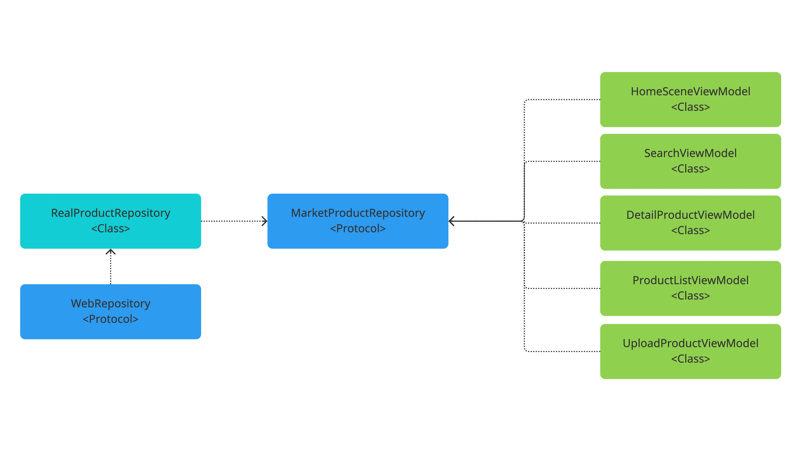
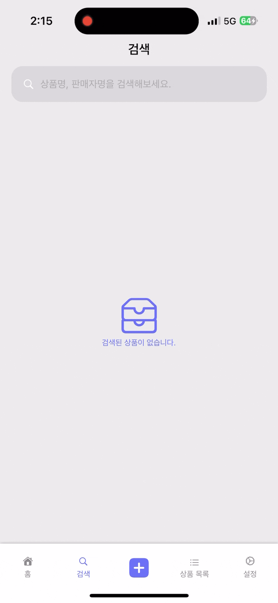
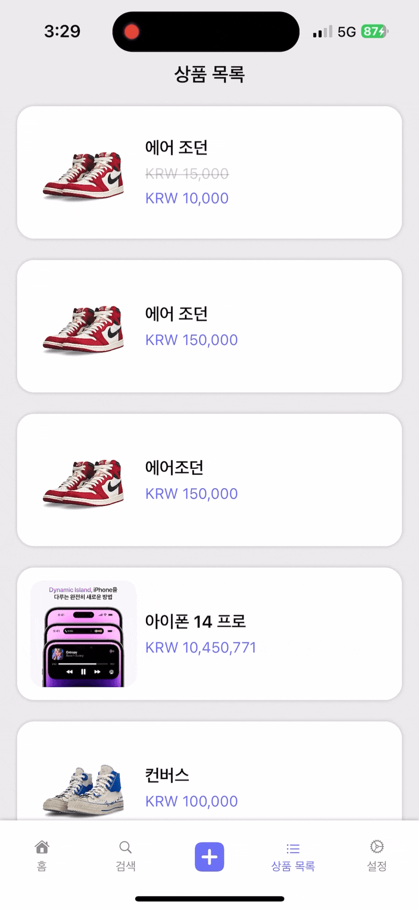
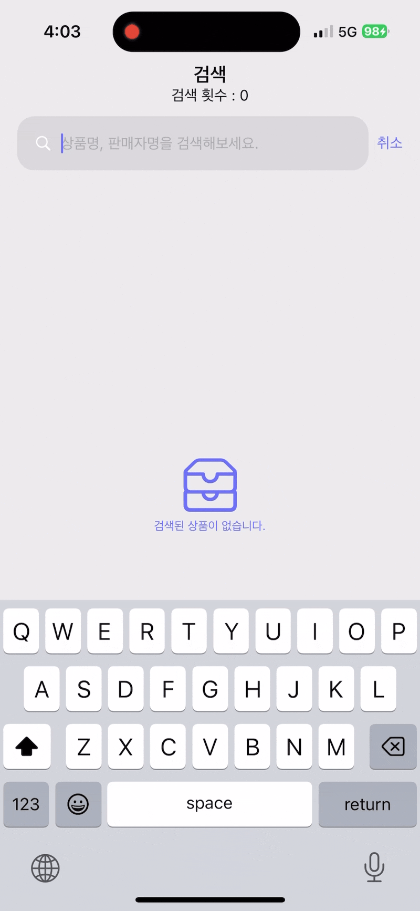

# 오픈 마켓 - SwiftUI

- 실제 서버를 활용하는 중고장터 앱
- OpenMarket API를 통해서 등록된 상품을 확인 가능
- 실제로 중고 상품에 대해서 등록 가능
- 기존에 구성된 프로젝트로 SwiftUI로 변경

## 목차
1. [팀 소개](#-팀-소개)
2. [개발 환경 및 라이브러리](#-개발환경-및-라이브러리)
3. [기능 소개](#-기능-소개)
4. [Diagram](#-diagram)
5. [폴더 구조](#-폴더-구조)
6. [타임라인](#-타임라인)
7. [프로젝트에서 경험하고 배운 것](#-프로젝트에서-경험하고-배운-것)
8. [트러블 슈팅](#-트러블-슈팅)
9. [참고 링크](#-참고-링크)

## 팀 소개
| [미니](https://github.com/leegyoungmin) |
| :---: |
|  |

### 개발환경
| UI | Architecture |
|----|----|
||

### 라이브러리
|구분|이름|
|---|---|
|네트워킹|`Alamofire`|

## 타임라인
| 날짜 |구현 내용|
| --- | --- |
|23. 04. 11| 라이브러리 추가 |
|23. 04. 12| 네트워크 관련된 모델 구현 |
|23. 04. 14| 기본 리스트 화면 구현 |
|23. 04. 16| 그리드 화면 구현 |
|23. 04. 17| 상품 등록 화면 구현 및 네트워킹 메서드 추가 |
|23. 04. 18| URLSession에서 Alamofire로 리팩터링 |
|23. 04. 20 ~ 21| 상품 등록 검증 후 에러 메세지 설정, 상세 상품 화면 구현|
|23. 04. 22| URL Path 잘못된 버그 수정, 삭제 기능 구현 |
|23. 04. 24| 상세 화면 버그 수정 |
|23. 04. 25| 추가 화면 구현을 위한 불필요한 변수 및 폴더 변경 |
|23. 04. 27| 홈 화면 내 최신 상품, 추천 상품 기능 구현 |
|23. 04. 28| 검색 화면 구현, 각 화면 테스트 및 버그 수정 |
|23. 05. 02| 화면 분리 구분 변경에 따른 폴더링 정리 |

## 다이어그램
- 파일 구조
```bash
# 하위 뷰 요소 `ChildViews`라는 폴더로 표시하였습니다.
├── Application
│   └── OpenMarket_SwiftUIApp.swift
├── Repository
│   ├── MarketProductRepository.swift
│   └── Networking
│       ├── EndPointing.swift
│       └── WebRepository.swift
└── Scene
    ├── HomeScene
    │   ├── HomeScene.swift
    │   └── HomeSceneViewModel.swift
    │       └── ChildViews
    ├── ListScene
    │   ├── DetailProductView
    │   │   ├── DetailProductView.swift
    │   │   ├── DetailProductViewModel.swift
    │   │   └── ChildViews
    │   ├── ProductListView
    │   │   ├── ProductListView.swift
    │   │   │── ProductListViewModel.swift
    │   │   └── ChildViews
    │   └── UploadProductView
    │       ├── UploadProductView.swift
    │       │── UploadProductViewModel.swift
    │       └── ChildViews
    ├── SearchScene
    │   ├── SearchView.swift
    │   │── SearchViewModel.swift
    │   └── ChoidViews
    ├── SettingScene
    │   └── SettingScene.swift
    └── TabContentView.swift
```

네트워크 관련 UML


## 실행화면
| 홈화면 | 검색 |
| :---: | :---: |
| | |

| 상품 목록 | 상품 상세 설명 |
| :---: | :---: |
|  |  |

| 상품 생성 | 상품 수정 | 상품 삭제 |
| :---: | :---: | :---: |
|  |  |  |

## 트러블 슈팅
### NavigationView의 RootView로 돌아가기
| 문제 상황 |
|:---:|
||

해당 문제는 NavigationView 내부의 `2 - Depth`의 자식 뷰의 Dismiss를 통한 화면을 없애는 과정에서 발생하였다. 내가 원하는 결과물은 수정이 이루어지지 않은 상황에서는 Root 뷰로 돌아가지 않도 상태를 유지할 수 있도록 하고, 수정이 되거나 삭제가 된 상황에서는 Root 뷰로 돌아 갈 수 있도록 하고 있었다.

하지만, 해당되는 기능을 구현하기 위해서는 Networking을 통해서 업도드가 된 상태에 대한 값을 통해서 RootView로 돌아가도록 하는 상태를 활용하면서 문제가 발생한 것이다. 상태라는 것은 하나는 하나의 상태를 관리하여야 하지만, 내가 구현한 코드는 하나의 상태를 통해서 2가지의 역할을 담당하도록 구현한 것이다.

이를 해결하기 위해서 Navigation의 상태를 기록하는 변수와 Networking의 결과를 담을 수 있는 2가지의 상태를 통해서 관리하도록 하였다.

### List View에 대한 데이터 Pagination
SwiftUI의 List라는 뷰는 굉장히 부드러운 애니메이션을 구현하면서 많은 기능을 지원한다. 하지만, 데이터를 받아서 뷰를 그려주는 뷰 프로토콜을 채택하고 있는 타입이기 때문에 데이터와의 직접적인 상호작용을 할 수는 없다. 또한, SwiftUI의 철학에 따라서 사용자 인터렉션에 대한 것은 뷰의 영역이 아니라 개발자가 원하는 기능을 할 수 있도록 구현되어 있기 때문에 네트워킹에 대해서도 직접적으로 개발자가 작성할 수 있도록 해야 한다.

#### 구현 내용
```Swift
// View 영역
ScrollView {
    LazyVStack {
        ForEach(viewModel.products, id: \.id) { product in
            DetailProductCell(with: product)
                .cornerRadius(16)
                .padding(.horizontal, 16)
                .padding(.vertical, 6)
                .onAppear {
                    viewModel.fetchNextPage(with: product)
                }
                .shadow(color: .black.opacity(0.2), radius: 2)
        }
    }
}

// ViewModel
func fetchNextPage(with lastItem: Product) {
    if lastItem.id == products.last?.id {
      fetchProducts()
    }
}
```

List의 위치를 파악하는 방법은 아직까지 지원을 하지 않고 있기 때문에 ScrollView를 활용하도록 하였다. 또한, 사용자와의 직접적인 상호작용 제스처가 없다고 판단하였기 때문에 ScrollView를 사용하였다. ForEach에 전달될 수 있는 타입은 Hashable한 타입이다. 그렇기 때문에 해당되는 타입의 ID의 비교를 통해서 데이터가 마지막 데이터인지 판단할 수 있게 된다. 마지막 데이터로 판단되면, 네트워킹을 수행하여서 데이터를 추가시킬 수 있도록 하여 문제를 해결하였다.

### 많은 검색 API 호출
검색을 구현하는 도중 많은 API 호출로 인해 많은 리소스가 낭비되는 것을 확인했다. 이를 해결하기 위해서 Debounce와 Throttling이라는 기법에 대해서 찾아보게 되었다. Debounce는 Publisher의 전송 간격과 개수를 제어하는 Operator이고, Throttling은 지정된 시간 간격에 따라서 Publisher의 첫번째 값을 구독하는 것을 의미하게 된다.

검색이라는 기능을 고려하였을 때 Throttling을 활용하게 된다면, 사용자가 데이터를 입력하는 부분이 구독이 되지 않아서 반영되지 않는 UI를 구성하게 된다. 이는 사용자에게 좋은 UX를 주는 것이 아니라고 생각하여서 Debounce를 통해서 일정 시간이 지난 후에 데이터를 변경 시켜서 네트워킹을 할 수 있도록 하였다.

| 적용 전 | 적용 후 |
|:---:|:---:|
|||

`onReceive` 메서드 내에서 `Debounce`를 적용하여서 `Airpod`이라는 글자의 검색횟수를 12에서 1로 줄였습니다.

---
[🔝 맨 위로 이동하기](#오픈마켓)
